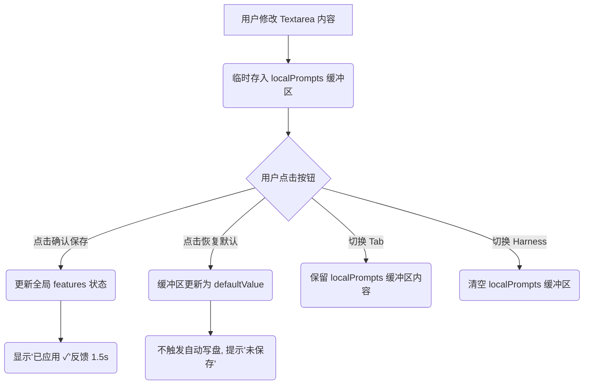

# 🕸️ 任务系统提示词一键注入与客制化看板设计文档 (Task System Prompt Customizer)

本文档定义了在 LLM Space 平台中，对 ReAct 任务看板特性（`task_manager`）引入高级提示词定制交互的 UI/UX 设计规范。

## 1. 背景与目标
在之前的迭代中，我们已重构了后端特性系统，将引导词（`todo_prompt` 与 `task_system_prompt`）从硬编码中分离为 `FeatureSchema.js` 的独立 `text_area` 默认配置，并在生命周期的 `preLLM` 阶段由插件动态装配。
本阶段目标是在前端页面 [PromptLabPage.jsx](file:///Users/mayufeng/fast_myf/LLM-Learning/llm-space/src/pages/PromptLabPage.jsx) 中实现支持这部分高级提示词自定义编辑、临时缓冲、重置与落盘交互的卡片面板。

---

## 2. 界面设计规范

### 2.1 底层工具强隐藏过滤
* 隐藏 `write_todos`, `create_task`, `list_tasks`, `get_task`, `claim_task`, `complete_task` 六个原子工具在 `PromptLabPage` 工具挂载 Tab 中的展示（已实现）。

### 2.2 二级配置条件渲染
当 `task_manager` 特性启用时：
* 只有当 `task_manager.mode === 'todo'` 时，才渲染并展示 `todo_prompt` 的编辑组件。
* 只有当 `task_manager.mode === 'task_system'` 时，才渲染并展示 `task_system_prompt` 的编辑组件。

### 2.3 嵌套折叠手风琴卡片 (方案 1)
为了保持界面的美观和清爽，避免普通用户受过多高级参数的干扰：
* 默认状态下，指引词编辑组件呈折叠状态。头部条栏显示 `⚙️ 自定义系统行为指引词 (XML 格式)` 和右侧 `[展开编辑 ▶]` / `[收起 ▲]` 交互按钮。
* 用户点击手风琴头部可自由切换其展开/收起状态。

### 2.4 大文本编辑框 (Text Area)
* **尺寸与滑动**：
  - `textarea` 的默认高度设为 `minHeight: 200px`，宽度 100%。
  - 显式配置 `overflowY: 'auto'`，当指引词内容行数溢出时自动出现平滑的垂直滚动条，支持用户在编辑框内上下滑动阅读。
  - 显式配置 `resize: 'vertical'`，高级用户可以根据喜好自由向下拖拽扩展编辑高度。
* **样式主题**：
  - 采用 monospace 等宽字体（如 `var(--font-mono)`）。
  - 使用暗色代码框背景（`var(--bg-base)`），使其与平台的主题完全契合，具有极佳的代码可读性。

---

## 3. 交互与状态控制流

### 3.1 临时输入缓冲区 (Local Buffer)
* **状态定义**：使用 React `localPrompts` 保存输入框的值，使输入阶段的临时改动只影响本地 state，不直接触底写盘。
* **隔离策略**：
  - **跨 Tab 切换**：在“Prompt 编辑器”、“实验特性”、“模板库”等 Tab 之间切换时，`localPrompts` 状态得到**完整保留**。
  - **跨 Harness 切换**：切换不同的 Harness 会话时，副作用 `useEffect` 将监听到 `harness.id` 变化，**直接丢弃**未保存缓冲区并将其置空，以便自动重新加载并绑定该 Harness 最新保存的持久化数据。

### 3.2 独立保存与确认 (Save)
* 在文本框下方提供显式的 `[💾 保存修改]` 按钮。
* 点击时：
  1. 调用平台统一的子特性修改回调 `handleSubFeatureChange(parentKey, subKey, localValue)`，将最新提示词正式更新入 Harness 的 `features` 状态。
  2. 独立保存状态 `promptSaveStatus[subKey]` 置为 `'saved'`，按钮文案变为 `已应用 ✓`（配以绿色高亮反馈），1.5 秒后自动复位。

### 3.3 恢复默认值与暂存保护 (Reset)
* 提供显式的 `[↩️ 恢复默认]` 按钮。
* 点击时：
  1. 将输入框绑定的缓冲区 `localPrompts[subKey]` 强行还原为 FeatureSchema 声明的 `defaultValue`。
  2. **不触发自动写盘**（不调用 `handleSubFeatureChange`），此时文本框为默认预设值，且按钮右侧显示黄色警告信息：*“提示词已恢复默认值，请点击‘保存修改’确认生效。”*

---

## 4. 验证计划
1. **渲染自检**：在 PromptLabPage 的“实验特性” Tab 下，开启任务看板管理，切换“线性看板”和“拓扑依赖”模式，验证 `todo_prompt` 与 `task_system_prompt` 折叠栏的单体呈现与过滤效果。
2. **滚动与伸缩验证**：向指引词 textarea 输入超长文本，确保滚动条自动出现，并且可以流畅上下滑动；验证垂直拖拽拉长文本框表现良好。
3. **隔离边界自检**：
   - 输入一些测试字符，不点保存，切到“Prompt 编辑器”再切回，验证测试字符完好。
   - 输入测试字符，不点保存，切换顶部 Harness 会话，验证缓冲区被丢弃，回到原始已保存状态。
4. **保存与重置交互自检**：
   - 修改指引词后点击“保存修改”，验证是否有 1.5 秒“已应用”的状态切换。
   - 点击“恢复默认”，验证编辑框内文字恢复为 XML 初始状态，但不触发 Harness 文件的直接修改，直到再次点保存才完成落盘。
